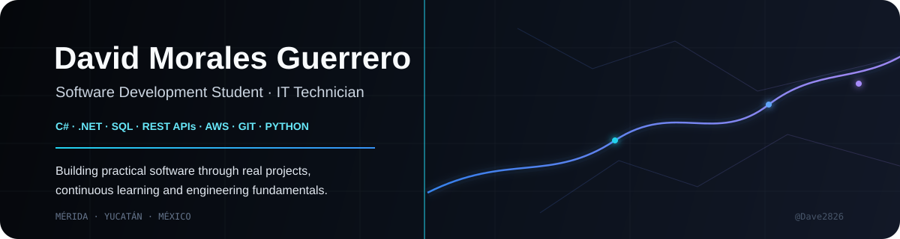

  

  <a href="https://www.linkedin.com/in/david-morales-guerrero-0b9849262/">LinkedIn</a>
  &nbsp;&nbsp;•&nbsp;&nbsp;
  <a href="https://github.com/Dave2826">GitHub</a>
  &nbsp;&nbsp;•&nbsp;&nbsp;
  <a href="mailto:david.morales@tecdesoftware.edu.mx">Email</a>

 

<h2>Software Development Student | IT Technician</h2>

I am a Software Development student and IT Technician based in Mérida, Yucatán, Mexico. I have professional experience in technical support, computer maintenance, networking and information analysis, and I am currently expanding that background into software engineering.

My strongest interests are backend development, databases, REST APIs, cloud technologies and applied artificial intelligence. I prefer learning by building real solutions, testing ideas and improving them through practice.

---

## Engineering profile

<table>
<tr>
<td width="33%"><strong>Backend</strong> C# · .NET · ASP.NET MVC · Python</td>
<td width="33%"><strong>Data</strong> SQL · PostgreSQL · Database Design</td>
<td width="33%"><strong>APIs & Cloud</strong> REST APIs · AWS · Cloud Operations</td>
</tr>
<tr>
<td><strong>Web</strong> HTML · CSS · JavaScript</td>
<td><strong>Workflow</strong> Git · GitHub · Linux</td>
<td><strong>Focus</strong> Architecture · AI · Problem Solving</td>
</tr>
</table>

## Featured projects

<table>
<tr>
<td width="50%">

### MotoTrack

Motorcycle management platform developed with C# and .NET. Focused on structured data, CRUD operations, business logic and practical application development.

<a href="https://github.com/Dave2826/MotoTrack">Explore MotoTrack →</a>

</td>
<td width="50%">

### Atlas

Business management platform designed for a family-owned retail store. Focused on inventory, sales operations and process organization.

<a href="https://github.com/Dave2826/Atlas">Explore Atlas →</a>

</td>
</tr>
<tr>
<td width="50%">

### MotoMods API

Backend project focused on REST API development and motorcycle-related data management.

<a href="https://github.com/Dave2826/MotoMods-API">Explore API →</a>

</td>
<td width="50%">

### Software architecture & academic work

Projects covering databases, software architecture, web development, APIs and application design.

<a href="https://github.com/Dave2826?tab=repositories">Explore repositories →</a>

</td>
</tr>
</table>

## What I am building toward

**Backend engineering** — strengthening C#, .NET, REST APIs, application architecture and business logic.

**Data engineering foundations** — improving SQL, PostgreSQL, database modeling and structured data management.

**Cloud** — developing practical knowledge of AWS and cloud operations.

**Applied AI** — learning how to integrate AI into useful software workflows and real-world solutions.

## Certifications & training

| Area | Training |
|---|---|
| Cloud | AWS Academy Graduate - Cloud Operations |
| Cloud | AWS Academy Graduate - Cloud Foundations |
| Artificial Intelligence | AI Fundamentals |
| Artificial Intelligence | AI for Brainstorming and Planning |
| Cybersecurity | Administration of Cyber Threats |
| Networking | Cisco Networking |
| Databases | SQL Fundamentals |
| Hardware | Computer Architecture |
| Security | Interpretation of ISO 27001:2022 |

## GitHub activity

  
  

## Contact

I am open to software development opportunities, internships, collaborative projects and technical conversations.

  <a href="https://www.linkedin.com/in/david-morales-guerrero-0b9849262/">LinkedIn</a>
  &nbsp;&nbsp;•&nbsp;&nbsp;
  <a href="mailto:david.morales@tecdesoftware.edu.mx">david.morales@tecdesoftware.edu.mx</a>
  &nbsp;&nbsp;•&nbsp;&nbsp;
  <a href="https://github.com/Dave2826">github.com/Dave2826</a>

 

  Software Development Student · IT Technician · Mérida, Yucatán, Mexico

